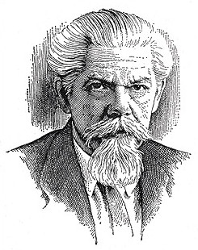

# Произношение и запись звуков



#### Ошибки в словах затрудняют общение. Причина ошибок в том, что слова не всегда пишутся так, как слышатся. Ведь, чтобы записать 42 звука есть только 33 буквы.

Сначала люди пользовались только устной речью. По мере развития общества появилась необходимость сохранять и передавать знания, тогда возникла письменная речь.

Сейчас основная задача письменной речи — передача информации на расстоянии. Мы постоянно используем письменную речь — даже, когда общаемся с друзьями в мессенджерах или социальных сетях.

В устной речи мы строим слова с помощью звуков, а в письменной — с помощью букв, которые обозначают эти звуки.

Гласные звуки «вырываются» из груди и образуют голос, мелодичный поток, произнесите: «**О-О-О**». 

Согласные звуки дополняют гласные и несут основную информацию слова. Согласные звуки получаются из-за прерывания этого потока языком и губами, попробуйте произнести: «**мО-лО-кО**». 

Произношение звука зависит от его положения в слове — в начале, середине или конце. Согласные и гласные звуки влияют друг на друга — делают мягче, звонче, глуше или даже меняют на другие. 

Многообразие изменений в произношении звуков никак не отображается на письме, поэтому одна буква может обозначать разные звуки, а иногда сразу два звука одновременно.

Давайте разберемся:



Узнаешь, какие бывают звуки речи и как их записывать.

15 минут чтение + 20 минут практика 

**Элементы модуля**
* Какие бывают звуки речи?
* Что такое гласные звуки?
* Что такое согласные звуки?
* Что такое слог и как он связан с ударением?
* Каковы особенности произношения гласных звуков?
* Как произносятся согласные звуки?
* Как звуки соотносятся с буквами?
* Расскажите о звуках, используя схему
* Проверим знания
* Для любознательных




## 1. Какие бывают звуки речи?



Нас окружает множество звуков, но только звуки речи **образуют слова**, которые обозначают понятия, предметы и явления окружающего мира.

      гласные звуки                 согласные звуки
           / \                         /   |    \    \---------\-------\ 
          /   \                       /    |     \              \       \
    ударные  безударные      сонорные  звонкие глухие        твердые  мягкие

Письменное отображение звуков речи называется **транскрипция → [тра́нцкр’ип’ц’иа]**. Для записи звуков используют буквы, квадратные скобки и специальные значки: ударение, знак мягкости и знак долготы.

**[ ‘ ]** — знак мягкости согласного звука ставится за звуком

**[ — ]** — знак долготы звука ставится над звуком



**Фоне́тика** *(от греч. phone ‒ звук) изучает звуки речи. В русском языке 6 гласных и 36 согласных звуков.*



<quiz>
    <question multiple>
        <p>Какие бывают согласные звуки?</p>
        <answer correct>сонорные</answer>
        <answer>ударные</answer>
        <answer correct>звонкие</answer>
        <answer>безударные</answer>
        <answer>глухие</answer>
        <answer correct>твердые</answer>
        <answer correct>мягкие</answer>
    </question>
</quiz>  




## 2. Что такое гласные звуки?



Гласными называются звуки, в образовании которых участвуют голосовые связки, а **воздух проходит через ротовую полость свободно**, беспрепятственно, создавая голос. В русском языке 6 гласных звуков — **[а, и, ы, у, о, э]**.

Основная задача гласных звуков — образовывать слог и способствовать удобству произношения, разрежая согласные звуки.

```
т[а]нк, л[и]с, с[ы]р, зв[у]к, д[о]м, р[э]ки,
[ударение], [катлета], [сахар]
```



<quiz>
    <question>
        <p>Как образовываются гласные звуки?</p>
        <answer correct>Воздух проходит через ротовую полость свободно</answer>
        <answer>Воздух встречает в полости рта преграду</answer>
    </question>
    <question>
        <p>Для чего нужны гласные звуки?</p>
        <answer>Нести смысловую информацию в слове</answer>
        <answer correct>Образовывать слог и способствовать удобству произношения</answer>
    </question>
</quiz>

**Выдели гласные звуки в предложении**

Исторически развитие и формирование правил русской орфоэпии сложилось так, что в основу литературного произношения положено московское произношение, на которое впоследствии «наслоились» некоторые варианты петербургского произношения.




## 3. Что такое согласные звуки?

При произнесении согласного звука **воздух встречает в полости рта преграду** из языка прижатого к зубам и сомкнутых губ. Струя воздуха преодолевает препятствие, и от этого получается не чистый голос, а шум. 

В русском языке 36 согласных звука, большинство образовывают пары из **твердых и мягких**:

| б | в | г | д | з | к | л | м | н | п | р | с | т | ф | х |
| -- | -- | -- | -- | -- | -- | -- | -- | -- | -- | -- | -- | -- | -- | -- |
| б' | в' | г' | д' | з' | к' | л' | м' | н' | п' | р' | с' | т' | ф' | х' |

```
прове[р]ка — ве[р’]ить
```

Не имеют парных звуков твердые согласные **[ж], [ш], [ц]** и мягкие согласные **[ч’], [щ’], [й’]**.

Еще согласные делятся на **глухие и звонкие**. Глухие согласные звуки целиком состоят из шума. В образовании звонких согласных участвует голос, они состоят из шума и голоса.

Есть сонорные (звучные) согласные. В этих согласных голос преобладает над шумом.

Большинство звонких и глухих согласных образуют пары:

| б | б' | -- | в | в' | -- | г | г' | -- | ж | -- | з | з' |
| -- | -- | -- | -- | -- | -- | -- | -- | -- | -- | -- | -- | -- |
| п | п' | -- | ф | ф' | -- | к | к' | -- | ш | -- | с | с' |

```
[д]ень — [т]ень, [д]уша — [т]уша
```

Не имеют парных звуков глухие согласные **[х], [х’], [ц], [ч’], [щ’]**, сонорные согласные **[л, л’], [м, м’], [н, н’], [р, р’], [й’]**.

Основная задача согласных звуков помогать гласным при образовании слога, — эта функция отразилась в их названии. Согласные звуки несут больше информации чем гласные, потому что  их больше и они разнообразнее. Если убрать гласные из слов, то смысл все равно будет различим:

```
молоток → м_л_т_к, согласные → с_гл_сн_
```



<quiz>
    <question>
        <p>Как образовываются согласные звуки?</p>
        <answer>Воздух проходит через ротовую полость свободно</answer>
        <answer correct>Воздух встречает в полости рта преграду</answer>
    </question>
    <question>
        <p>Для чего нужны согласные звуки?</p>
        <answer correct>Нести смысловую информацию в слове</answer>
        <answer>Образовывать слог и способствовать удобству произношения</answer>
    </question>
</quiz>

**Составьте словосочетание с каждым словом**

* ел — ель
* стал — сталь
* удар — ударь
* вес — весь
* брат — брать
* банка — банька

**Замени начальный согласный на парный ему глухой или звонкий**

дом → том

почка, точка, доска,  балка, горка, колос, тело, злой, жар

**Охарактеризуй согласные звуки**

Звук [б] — звонкий твердый согласный, [ш] — глухой твердый согласный, не имеет парного мягкого 

цель, дата, успех, щедрый, чай




## 4. Что такое слог и как он связан с ударением?



Группы из одного, двух и более звуков называются слогом. Слог произносится одним толчком воздуха и может быть ударным или безударным. Ударение — это произнесение одного из слогов слова с большей силой и длительностью.

В русском языке ударение разноместное (свободное) — может падать на любой слог:
```
1-ый слог — ди́к-тор
2-ой слог — ар-бу́з
3-ий слог — уди-ви-те́ль-ный`
4-ый слог — пе-ре-во-ра́-чи-вать-ся
```
Разноместность ударения позволяет различать слова и разные грамматические формы одного и того же слова:

```
за́-мок (приспособление для запирания)
за-мо́к (крепость)

му-ка́ (размолотые хлебные зерна)
му́-ка (сильное страдание)

пи́ща — существительное, но пища́ — деепричастие (от глагола «пищать»)
```

Кроме того ударение является подвижным, то есть при образовании разных грамматических форм оно может передвигаться с одного слога на другой:

```
о́к-на — Им.п. мн.ч.
ок-на́ — Род.п. ед.ч.
```
Неверное ударение разрушает слово, лишает его смысла. В русском языке нет единого правила постановки ударений, поэтому определить правильное произношение слова поможет только орфографиеский или орфоэпический словарь.  



**Орфоэ́пия** *(от греческого. orthos «правильный» и epos «речь», т.е. правильная речь) изучает правила постановки ударения в словах и произношения звуков и звукосочетаний.*

**Орфоэпический словарь** *поможет проверить правильность постановки ударения. Самый знаменитый орфографический словарь по русскому языку составил С.И.Ожегов в 1949, словарь постоянно переиздается и дополняется.*




**Сергей Иванович Ожегов**, 1900-1964, лингвист



<quiz>
    <question multiple>
        <p>Из какого количества звуков может быть слог?</p>
        <answer correct>Из одного звука</answer>
        <answer correct>Из двух звуков</answer>
        <answer correct>Из двух и более звуков</answer>
    </question>
</quiz>  

**Раздели на слоги и поставьте ударение**

флаги → фла́-ги

снял, звенело, поищем, утиный, бросала, фонарь, несу, журавль

**С каждым словом составь словосочетание**

* хло́пок — хлопо́к
* о́куни — окуни́
* про́пасть — пропа́сть
* зе́мли — земли́
* до́ски — доски́




## 5. Каковы особенности произношения гласных звуков?

Гласные звуки **[а́, и́, ы́, у́, о́, э́] под ударением произносятся четко**. Гласные звуки без ударения, которые обозначаются буквами **о, а, е, я, произносятся менее отчетливо или даже заменяются другими звуками**.

В первом перед ударением **( _ _́ _ ), первый предударный слог**, слоге на месте буквы **о, а** произносится менее отчетливый звук **[а]**:
```
това́р → т[а]ва́р
бато́н → б[а]то́н
```
На месте букв **е, я** произносится звук, близкий к **[и]**:
```
теря́ть → т[и]ря́ть
тяну́ться → т[и]ну́ться.
```
В остальных безударных слогах **( _́ _ или _ _ _́ ), кроме первого предударного**, после твердых согласных на месте **о, а** произносится очень слабый звук **[ъ]**, похожий на **[ы]**:
```
ло́шадь → ло́[шъ]дь
команди́р → [къ]манди́р.
```
После мягких согласных на месте **е, я** очень слабый звук **[ь]**, похожий на **[и]**:
```
Ка́тя → Ка́[т’ь]
теремо́к → [т’ь]ремо́к
```
Гласные звуки без ударения, которые обозначаются буквами **у, и, ы** произносятся отчетливо, но кратко.
```
приго́рок → пр[и]го́рок
```



<quiz>
    <question>
        <p>Какие гласные звуки без ударения произносятся четко?</p>
        <answer>о, а, е, я</answer>
        <answer correct>у, и, ы</answer>
    </question>
</quiz>  

**Поставь ударение и составь транскрипцию**

пригорок, пылесос, кинуть



## 6. Как произносить согласные звуки?



Если согласный **звонкий звук** стоит в конце слова или перед глухим согласным, то он **оглушается**. Если **глухой** стоит перед звонким, то он **озвончается**.

Звонкие согласные заменяются на глухие, если стоят перед глухими согласными или стоят в конце слова. Это называется оглушением.

```
встать → [ф]стать
пирог → пиро[к]
```

Глухие согласные заменяются на звонкие, если стоят перед звонкими согласными. Это называется озвончением.

```
сдать → [з]дать
молотьба → моло[д’]ьба
```

Чтобы проверить правописание парной согласной в слабой позиции надо подобрать однокоренное слово или изменить форму слова так, чтобы после этой согласной стояла гласная или звонкая согласная:

```
гриб → грибник → грибок→ грибки, грибной
```



<quiz>
    <question>
        <p>Что такое оглушение?</p>
        <answer>Когда глухой стоит перед звонким</answer>
        <answer correct>Когда согласный звонкий звук стоит в конце слова или перед глухим согласным</answer>
    </question>
</quiz>  

**Что происходит с выделенной согласной?**

укаЗка, глаЗ, проСьба, сберечь, похоДка, Сдать, Что, яиЧНица, Чтобы, пустяЧНый, скуЧНо



## 7. Как звуки соотносятся с буквами?



В русском языке звуков больше чем букв: 42 звука и 33 буквы. Поэтому **одна буква может передавать на письме разные  звуки**. Ранее мы видели как чередуются гласные и согласные звуки при том, что обозначающая их буква не меняется. Сейчас рассмотрим мягкость согласного и двойную роль букв **е, ё, ю, я**.

Чтобы указать на мягкость согласного, который стоит перед другим согласным или в конце слова, мы пишем букву **ь**:
```
[ба́н’ка] → банька
[де́н‘] → день
[бале́л’щик] → болельщик
```
Есть исключения, когда мягкий знак не пишется. Их надо проверять в орфографическом словаре, к ним относятся слова:
```
мостик
гвоздик
```
В сочетаниях **ч, щ** с другими согласными буквами мягкий знак для обозначения мягкости не пишем, так как у мягких **[ч’, щ’]** нет твердой пары от которой их нужно отделять:
```
[хи́щ’ник] → хищник
[го́нщ’ик] → гонщик
```
Гласные буквы **е, ё, ю, я** смягчают согласный перед ними. Указывая на мягкость согласного, буквы е, ё, ю, я одновременно обозначают гласные звуки **[э], [о], [у], [а]**:
```
вес → [в’эс], 
мёд → [м’от]
люк → [л’ук]
ряд → [р’ат]
```
Вторая роль букв **е, ё, ю, я** обозначать сочетания двух звуков — **[й]** и гласного. В начале слова, после гласной и после разделительных ъ и ь обозначают по два звука — **[й‘э], [й‘о], [й‘у], [й‘а]**.
```
ель→ [й’эл’]
ёж → [й’ож]
каюта → [кай’ута]
обезьяна → [абиз’й’ана]
```


**Алфави́т** *(от греческого alpha + beta — названия двух первых греческих букв) расположение букв в определенном порядке.*

*В русском языке 33 буквы:*
*10 обозначают гласные звуки → гласные буквы*
*21 обозначают согласные звуки → согласные буквы*
*две буквы — ъ и ь, которые не обозначают звуков*

| А — а | Б — бэ | В — вэ |
| -- | -- | -- |
| Г — гэ | Д — дэ | Е — е |
| Ё — ё | Ж — жэ | З — зэ |
| И — и | Й — и краткое | К — ка |
| Л — эль | М — эм | Н — эн |
| О — о | П — пэ | Р — эр |
| С — эс| Т — тэ | У — у |
| Ф — эф | Х — ха | Ц — цэ |
| Ч — че | Ш — ша | Щ — ща |
| Ъ — твердый знак | Ы — ы | Ь — мягкий знак |
| Э — э | Ю — ю | Я — я |



<quiz>
    <question>
        <p>Чего больше в русском языке букв или звуков?</p>
        <answer>Букв</answer>
        <answer correct>Звуков</answer>
    </question>
</quiz>  

**Составь транскрипцию**

енот, ягода



## 8. Расскажите о звуках, используя схему




## 9. Проверим знания



Вы узнали, какие бывают звуки речи, как они взаимодействуют друг с другом и как превращаются в буквы. Применим эти знания на практике. Прослушайте предложение, запишите его, разберите звучание слов.

*Фонетический разбор*

1. Разделите слово на слоги и поставьте ударение;
2. Обозначьте гласные звуки и их буквы, отметьте ударный и безударные;
3. Обозначьте согласные звуки и их буквы, отметьте звонкость (в том числе сонорность) и глухость, твердость и мягкость;

```
со-ю́з
с — [c] глухой
о — [а] гласный, безударный
ю — [й’] сонорный
    [у] гласный, ударный
з — [с] глухой

4 буквы, 5 звуков
```



## 10. Для любознательных



Рекомендуемые аудио-видео передачи

Рекомендуемая литература

1. Алексей Шахматов. Исследования в области русской фонетики. 2015.
2. Алла Акишина, Светлана Барановская. Русская фонетика на фоне общей, 2011.



*Следующий модуль*

* Из чего состоит слово



fQZsPCm3Xjw
